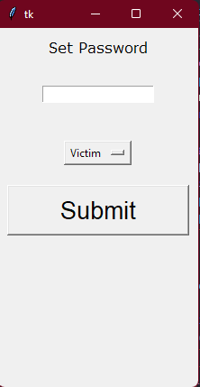
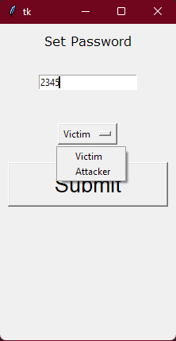
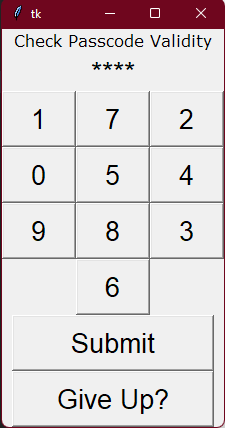
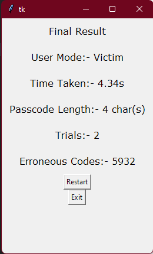

# PasscodeRandomizer
The official repository for the Passcode Randomizer application

Developed as part of the University of Glasgow research project course in Human Centred Security. <br>
Developer: Sayan Bandyopadhyay <br>
Date: 2023-03-13 <br>
License: MIT License <br> 

# <PasscodeRandomizer>

## Description

This application was developed as part of the University of Glasgow research project course in Human Centred Security.

- To recognise the effectiveness of the Passcode Randomizer application in the context of a real-world scenario.
- This application is part of a larger research study to recognize the effectiveness of UI elements manipulation for better security in applications
- The research study is provided:-

## Table of Contents (Optional)

- [Installation](#installation)
- [Usage](#usage)
- [License](#license)

## Installation

To install and run in your local machine, follow these steps:

```bash
$ apt install python3
$ pip3 install -r requirements.txt
$ python3 src/main2.py
```

## Usage

The screenshots from the running application ensure that there is proper usage and understanding of the research methodology.






## License

MIT License

Copyright (c) [year] [fullname]

Permission is hereby granted, free of charge, to any person obtaining a copy
of this software and associated documentation files (the "Software"), to deal
in the Software without restriction, including without limitation the rights
to use, copy, modify, merge, publish, distribute, sublicense, and/or sell
copies of the Software, and to permit persons to whom the Software is
furnished to do so, subject to the following conditions:

The above copyright notice and this permission notice shall be included in all
copies or substantial portions of the Software.

```
THE SOFTWARE IS PROVIDED "AS IS", WITHOUT WARRANTY OF ANY KIND, EXPRESS OR
IMPLIED, INCLUDING BUT NOT LIMITED TO THE WARRANTIES OF MERCHANTABILITY,
FITNESS FOR A PARTICULAR PURPOSE AND NONINFRINGEMENT. IN NO EVENT SHALL THE
AUTHORS OR COPYRIGHT HOLDERS BE LIABLE FOR ANY CLAIM, DAMAGES OR OTHER
LIABILITY, WHETHER IN AN ACTION OF CONTRACT, TORT OR OTHERWISE, ARISING FROM,
OUT OF OR IN CONNECTION WITH THE SOFTWARE OR THE USE OR OTHER DEALINGS IN THE
SOFTWARE.
```

---

## Features

- For User Testing and Feedback
- Developers can use this to test passcode recognition
- Separate Victim and Attacker Profiles
- Easy to use UI
- Output to case csv files for research